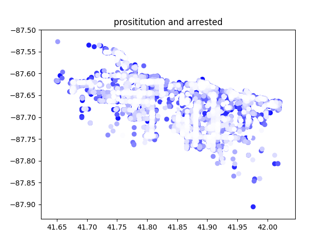
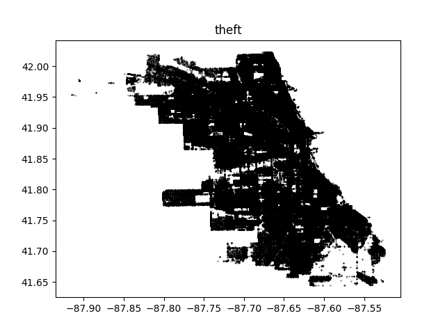
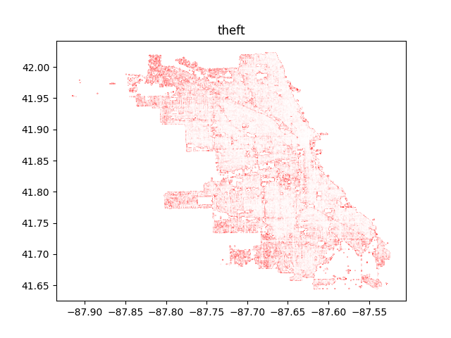
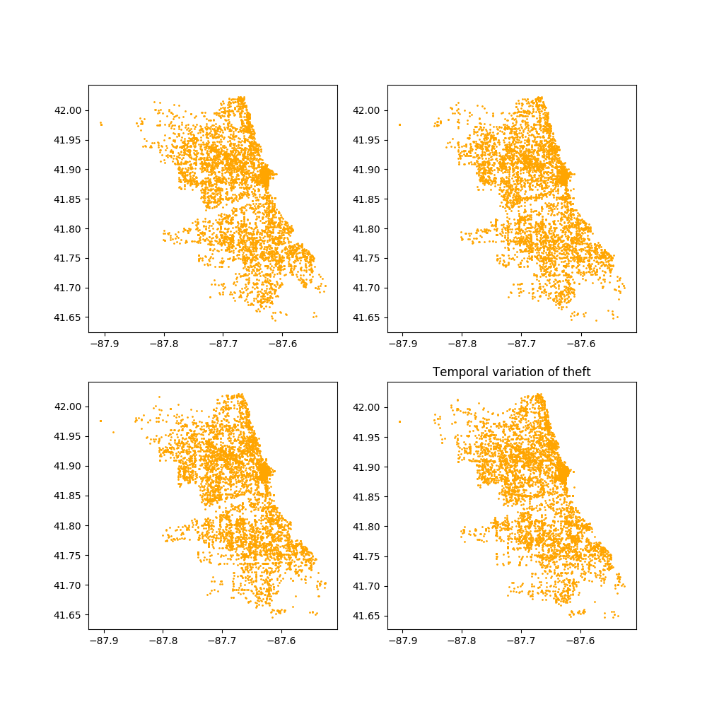
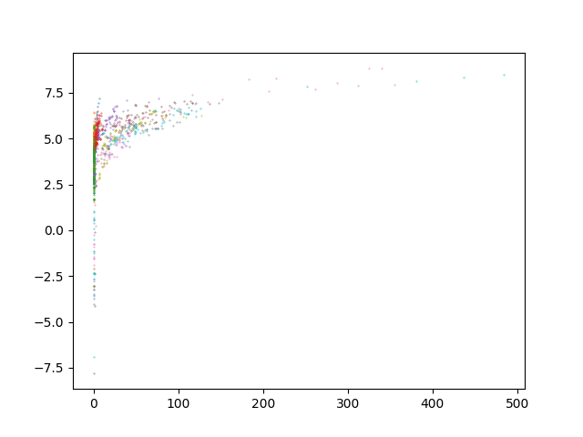
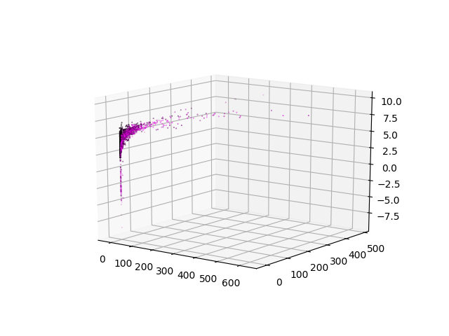
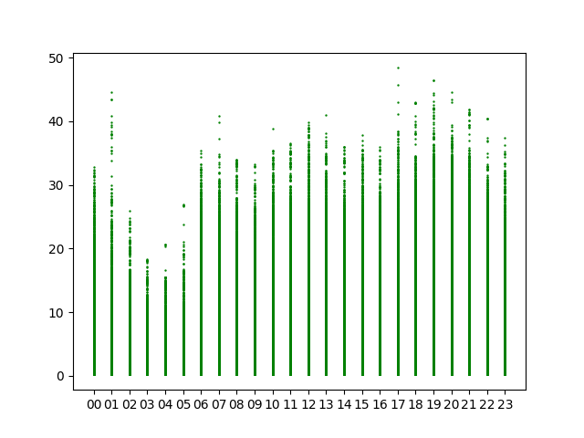

# Data set selection
Attached you can find some graphics generated while exploring datasets that we
discarded for the analysis with spark: 

# Sports dataset
The following file contains a plot of *an extract* of the raw data. We expect a
similar plot for the data that is processed by Spark. 

